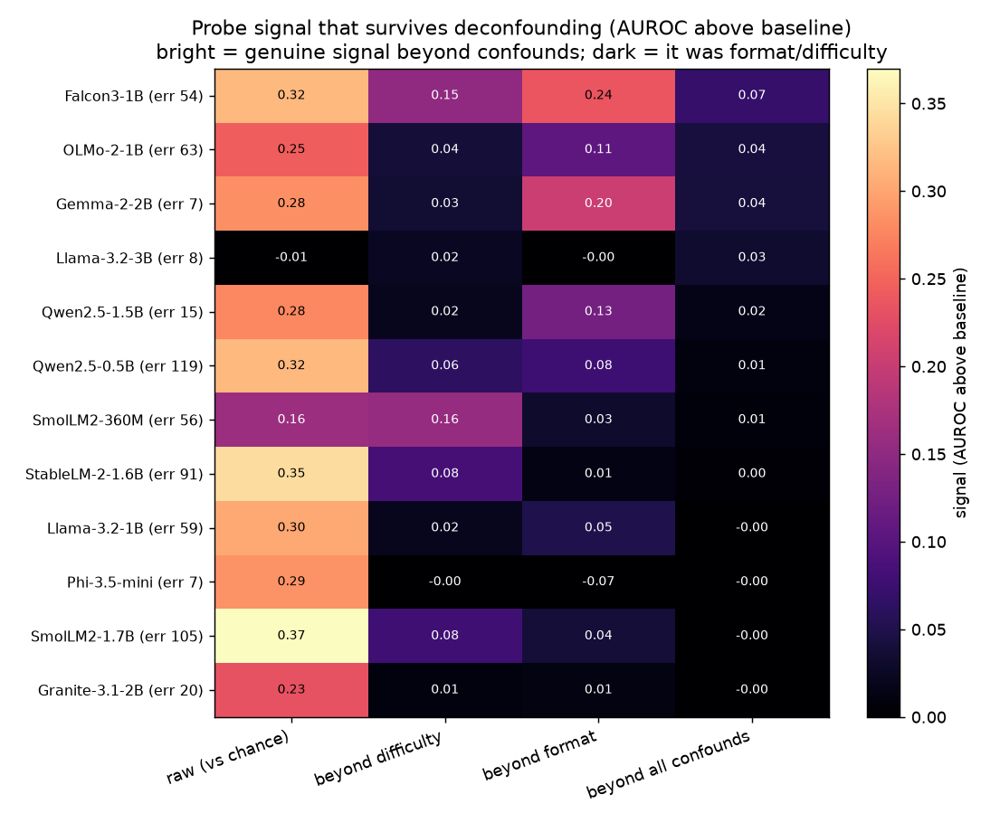
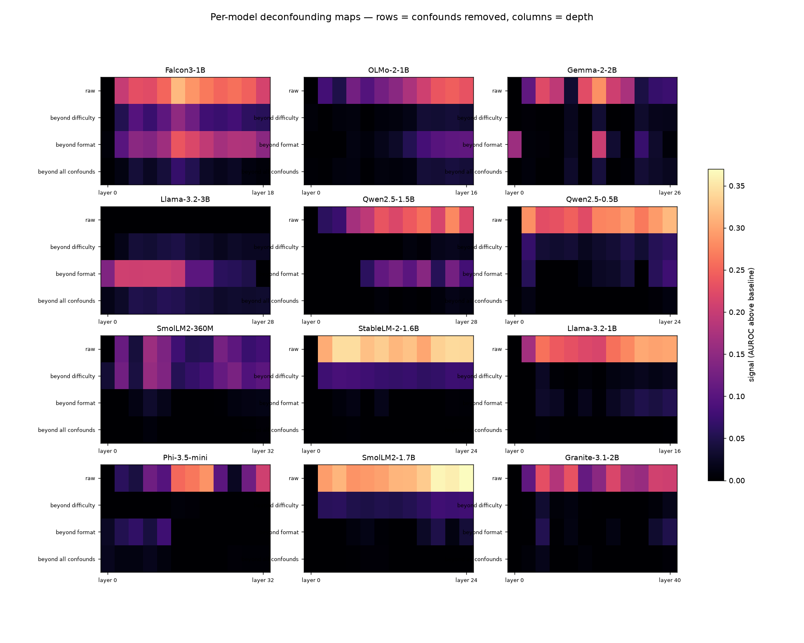
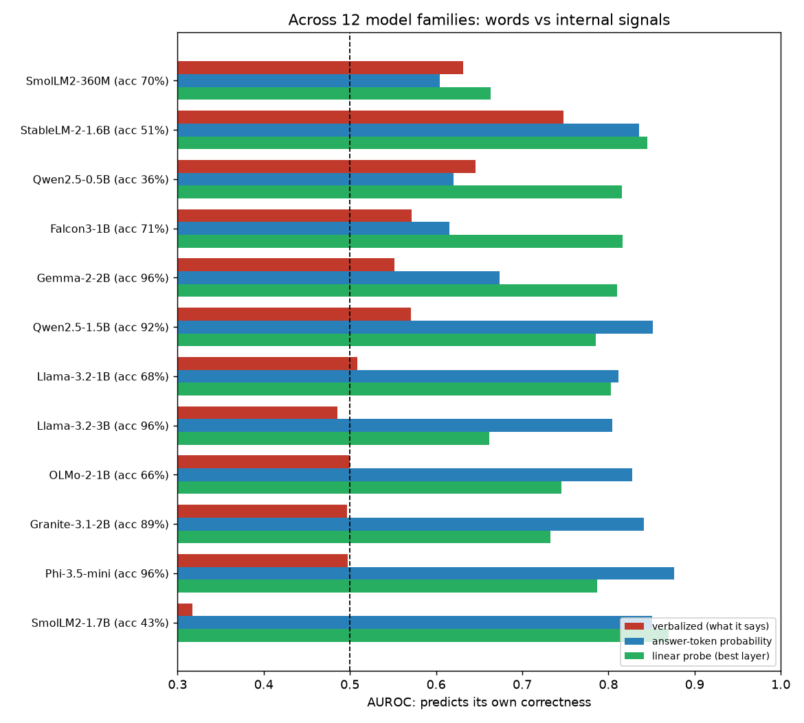
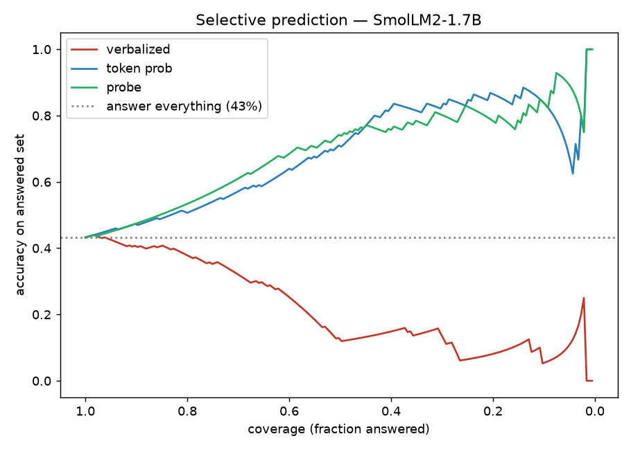
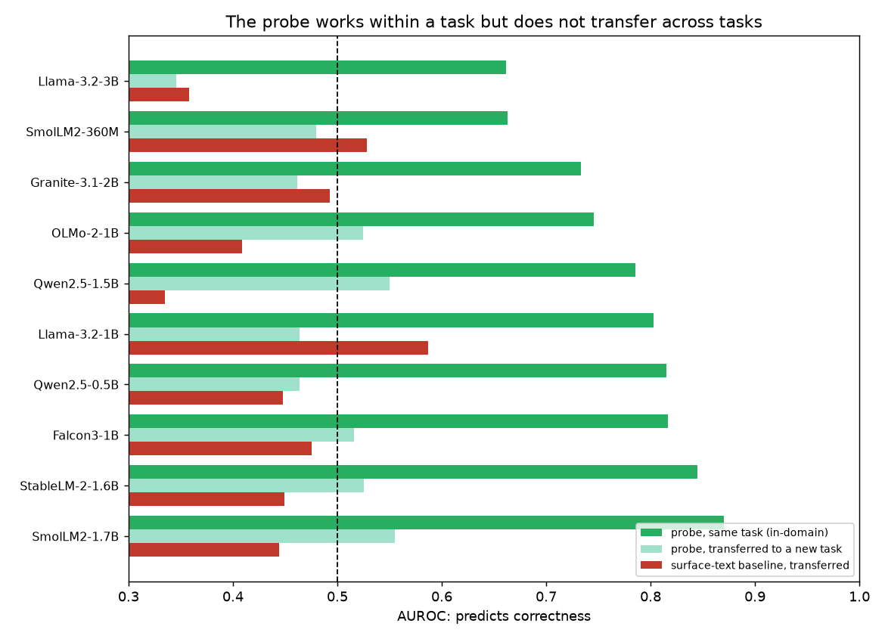
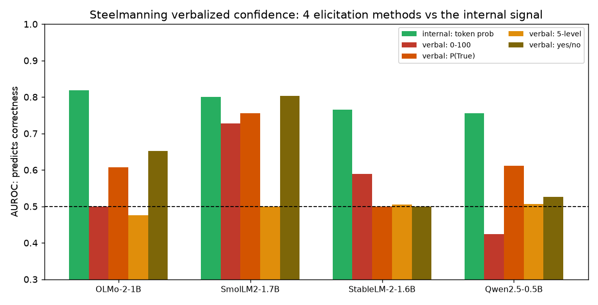
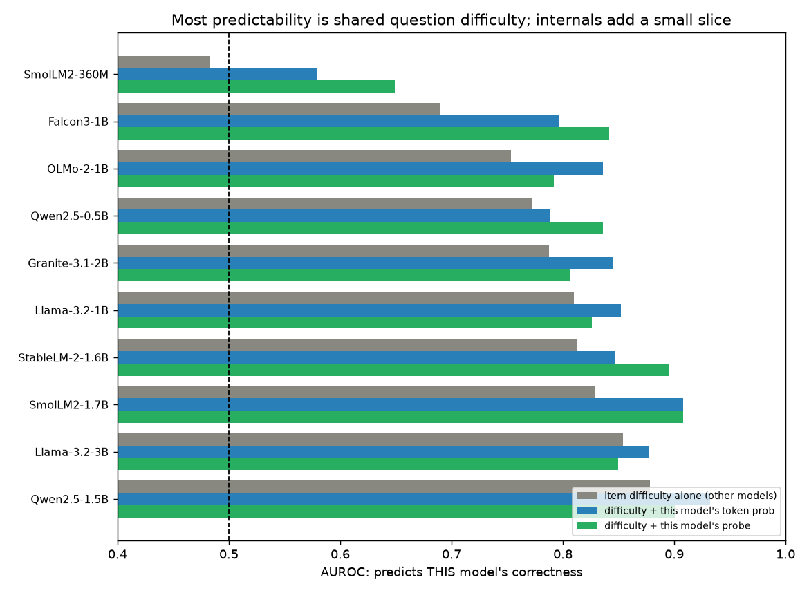
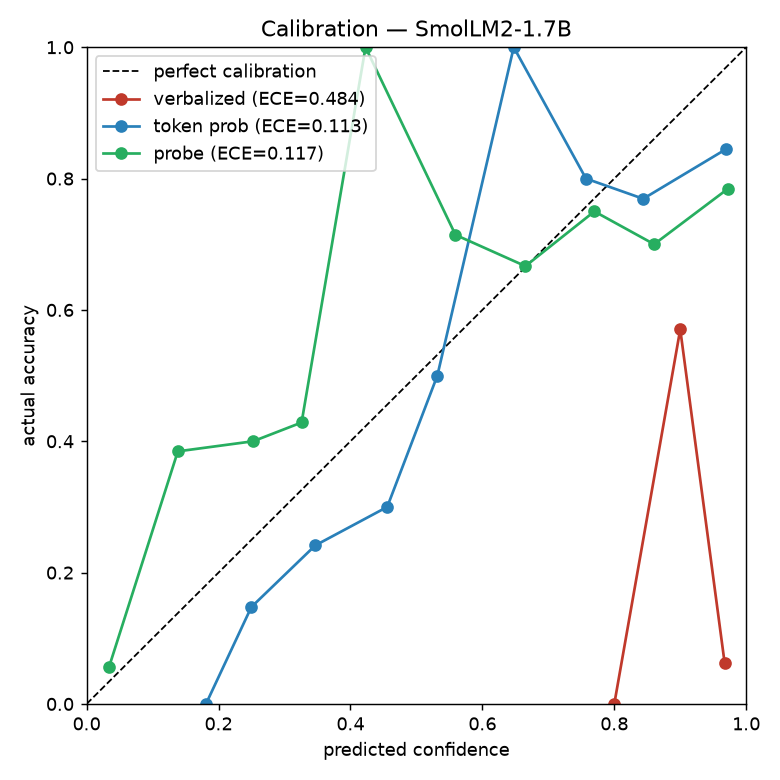

```
 ██████╗ ██████╗ ███╗   ██╗███████╗██╗██████╗ ███████╗███╗   ██╗ ██████╗███████╗
██╔════╝██╔═══██╗████╗  ██║██╔════╝██║██╔══██╗██╔════╝████╗  ██║██╔════╝██╔════╝
██║     ██║   ██║██╔██╗ ██║█████╗  ██║██║  ██║█████╗  ██╔██╗ ██║██║     █████╗
██║     ██║   ██║██║╚██╗██║██╔══╝  ██║██║  ██║██╔══╝  ██║╚██╗██║██║     ██╔══╝
╚██████╗╚██████╔╝██║ ╚████║██║     ██║██████╔╝███████╗██║ ╚████║╚██████╗███████╗
 ╚═════╝ ╚═════╝ ╚═╝  ╚═══╝╚═╝     ╚═╝╚═════╝ ╚══════╝╚═╝  ╚═══╝ ╚═════╝╚══════╝
```

# Internal versus verbalized confidence in small language models

**TL;DR.** Does a small model know when it is wrong? Reading its internal activations predicts its own correctness far better than asking it in words (AUROC about 0.80 versus 0.53). But three controls gut the strong story. Most of that signal is just question difficulty, a question the other models miss too, so it is not self-knowledge. The probe does not transfer across tasks (chance, 0.49). And verbalized confidence is not useless once you elicit it well. The defensible claim is a faint, task-specific edge for internal signals, not a general introspective sense of error. 12 open models, on a laptop. Working notes, not peer reviewed.

**ELI5.** We checked whether a small AI can tell when it got something wrong. Peek inside its activations and it looks like it can. But mostly it is just noticing the question was hard, the kind everyone gets wrong, not actually knowing itself. And what it learns about one kind of question does not carry over to another. So it is not really self-aware about its mistakes, it just spots hard questions.

## Summary

When a small language model answers a factual question, what predicts whether it is right: what the model *says* about its confidence, or signals read from *inside* it? I measured three predictors across 12 open-weight instruction-tuned models (0.36B to 3.8B) on a 16 GB laptop:

1. **Verbalized confidence.** Ask the model, in words, how sure it is.
2. **Answer-token probability.** The probability it places on the token it emits.
3. **A linear probe** on the residual stream, trained to predict correctness from activations.

The raw comparison: median AUROC is 0.53 for verbalized confidence (chance is 0.5), 0.82 for token probability, and 0.80 for the probe. Taken at face value, the model's internal state predicts its own correctness while its words do not.

Three controls show that face value is misleading, and produce a much smaller, more careful claim.

- **Difficulty.** Most of the predictability is not self-knowledge. Item difficulty alone (how many of the other 11 models answer a question correctly) predicts a given model's correctness at mean AUROC **0.767**, with no access to that model's internals. Adding the model's own token signal raises this to **0.826**: a real but **small increment of +0.06**, statistically significant in only **5 of 10** error-rich models. A full per-layer deconfounding audit across all 12 models (difficulty *and* format) gives the same result: the probe's signal is near zero (median +0.01) once both are removed. See the audit section below.
- **Cross-task transfer.** A probe trained on capital-city questions and tested on atomic-number questions performs at chance (mean AUROC **0.49**). The activation signal does not transfer across tasks. It encodes task-specific structure, not a portable "I don't know" direction.
- **Elicitation.** Verbalized confidence is prompt-sensitive. Asked on a 0-100 scale it looks useless, but the best of four elicitation methods (0-100, P(True), a five-level scale, yes/no) averages **0.66** and ties the internal signal for one model. The "words are useless" impression was partly a weak prompt.

**The defensible claim:** a model's own internal signals predict its factual correctness slightly better than its verbalized confidence, and this survives steelmanning the verbalization. But the effect is small once shared question difficulty is removed, it is task-specific, and verbalized confidence is not useless when elicited well. The strong reading, that these models have a general introspective sense of their own errors, is not supported here.

## Repository structure

Run the scripts from the repository root.

| Path | What it is |
|---|---|
| `README.md` | This writeup |
| `figures/` | All figures shown below |
| `run12.py` | Collects activations plus the three confidence signals for all 12 models |
| `controls12.py` | Surface-text, shuffled-label, and within-family controls |
| `run13_isolation.py` | Cross-task transfer test (train on one task, test on another) |
| `run14_elicitation.py` | Four verbalized-confidence elicitation methods |
| `run15_difficulty.py` | Difficulty decomposition (does the signal survive controlling for item difficulty?) |
| `run16_deconfound.py` | The per-layer, per-model deconfounding audit plus its figures |
| `06_rich_analysis.ipynb` | Regenerates the calibration, risk-coverage, and ROC figures |
| `*_results.json` | Saved numeric results from the scripts above |
| `requirements.txt`, `references.bib`, `CITATION.cff`, `LICENSE` | Setup, citations, metadata |

## Relation to prior work

This reproduces and qualifies existing work rather than discovering anything. Kadavath et al. (2022) showed large models can estimate the probability that they know an answer. Question-only linear probes predicting accuracy, and beating verbalized confidence, appear in arXiv:2509.10625. Goldowsky-Dill et al. (2025) train deception-detection probes on a 70B model that transfer to held-out settings. My only additions are breadth (12 small families on a laptop) and a difficulty-control plus cross-task transfer test that the within-task results do not survive. See `references.bib`.

## Setup

**Models.** Qwen2.5 (0.5B, 1.5B), SmolLM2 (360M, 1.7B), Phi-3.5-mini (3.8B), Falcon3-1B, OLMo-2-1B, Granite-3.1-2B, StableLM-2-1.6B, Gemma-2-2B, Llama-3.2 (1B, 3B). Loaded in `bfloat16` with SDPA attention.

**Data.** 185 short-answer factual questions: 85 country capitals and 100 element atomic numbers. Comparable structure, disjoint vocabulary, which is what makes the cross-task test possible.

**Correctness.** The model generates a greedy answer $a_i$; the label $y_i \in \{0,1\}$ is 1 on accent-insensitive match (capitals) or integer match (atomic numbers).

## Signals and estimators

Let $h_i^{(\ell)} \in \mathbb{R}^{d}$ be the residual stream at layer $\ell$, taken at the final prompt token.

Verbalized confidence $c^{\mathrm{v}}_i \in [0,1]$ is parsed from the model's stated answer. Answer-token probability is

$$c^{\mathrm{tok}}_i = \max_{v} \mathrm{softmax}(z_i)_v$$

at the answer position with logits $z_i$. The probe is logistic regression on standardized activations,

$$\hat{p}_i = \sigma\left(w^\top \tilde{h}_i^{(\ell)} + b\right), \qquad \sigma(z)=\tfrac{1}{1+e^{-z}},$$

L2-regularized ($C=0.05$), scored with 5-fold cross-validated out-of-fold predictions, layer chosen by CV AUROC. Best-layer selection is mildly optimistic (nested CV deflates it about 0.05).

## Metrics

AUROC for discrimination (chance 0.5). Expected calibration error over $M=10$ bins,

$$\mathrm{ECE}=\sum_{m=1}^{M}\frac{|B_m|}{n}\bigl|\mathrm{acc}(B_m)-\mathrm{conf}(B_m)\bigr|.$$

95% intervals by stratified bootstrap (2000 to 3000 replicates). Selective accuracy at coverage $\phi(\tau)=\tfrac1n\sum_i \mathbf 1[s_i\ge\tau]$. For the difficulty control I define item difficulty $d_q=\tfrac{1}{M-1}\sum_{m'\ne m} y_{m',q}$ and test whether a signal adds AUROC over $d_q$ in a logistic model.

## Raw results

| Model | acc | verbalized | token | probe |
|---|---:|---:|---:|---:|
| Qwen2.5-1.5B | 92% | 0.571 | 0.852 | 0.785 |
| Qwen2.5-0.5B | 36% | 0.646 | 0.620 | 0.815 |
| SmolLM2-1.7B | 43% | 0.317 | 0.851 | 0.870 |
| SmolLM2-360M | 70% | 0.632 | 0.605 | 0.663 |
| Phi-3.5-mini† | 96% | 0.497 | 0.876 | 0.787 |
| Falcon3-1B | 71% | 0.572 | 0.615 | 0.816 |
| OLMo-2-1B | 66% | 0.500 | 0.827 | 0.745 |
| Granite-3.1-2B† | 89% | 0.497 | 0.841 | 0.733 |
| StableLM-2-1.6B | 51% | 0.748 | 0.836 | 0.845 |
| Gemma-2-2B† | 96% | 0.551 | 0.673 | 0.810 |
| Llama-3.2-1B | 68% | 0.508 | 0.812 | 0.803 |
| Llama-3.2-3B† | 96% | 0.486 | 0.804 | 0.662 |

† 7 to 20 errors only; AUROC unstable, indicative at best. `figures/fig_crossmodel.png`, `fig_calibration.png`, `fig_roc_dist.png`. Selective prediction (`fig_risk_coverage.png`): abstaining by the internal signal lifts SmolLM2-1.7B from 43% toward 85%; abstaining by its stated confidence drives accuracy down. For that model the words point the wrong way.

## How much is real? Three isolation controls

**1. Difficulty (`fig_difficulty.png`).** Item difficulty alone predicts a model's correctness at 0.767; adding the model's own token signal gives 0.826, a +0.06 increment, significant in 5 of 10 error-rich models. The probe adds beyond difficulty too, sometimes more (StableLM 0.81 to 0.90), so a genuine model-specific signal exists. But most of the headline AUROC is shared difficulty, not introspection.

**2. Cross-task transfer (`fig_isolation.png`).** Train the probe on capitals, test on atomic numbers (and reverse): mean AUROC 0.49. The surface-text baseline transfers at 0.45. The within-task probe signal is task-specific; there is no single portable correctness direction across these two tasks at this scale.

**3. Steelmanning verbalized confidence (`fig_steelman.png`).** Four elicitation methods on the error-rich models. Best-of-four averages 0.66 versus 0.79 for the internal signal, so internal beats verbalized even when verbalized gets its best shot. But the gap is about 0.12, not the 0.27 the 0-100 prompt alone implied, and for SmolLM2-1.7B a yes/no elicitation (0.804) ties the internal signal (0.800). Which method works is erratic across models.

Other controls: shuffled labels collapse the probe to chance; restricting to one task family the probe still predicts (so it is not merely separating the two tasks); a character n-gram model on the question text reaches 0.59 to 0.80, confirming that much of correctness is question-determined.

## The deconfounding audit (all 12 models)

[arXiv:2606.02907](https://arxiv.org/abs/2606.02907) showed, on a single model, that probes which appear to classify "reasoning type" actually detect task format, and argued that format deconfounding should become routine. I ran that audit on all twelve models for the correctness probe. At each depth I measured the probe's signal (AUROC above the relevant baseline), then re-measured it after removing (a) cross-model question difficulty, (b) format (question type and length), and (c) both. See `figures/fig_deconf_master.png` and `figures/fig_deconf_grid.png`.

Raw probe signal is large everywhere: +0.16 to +0.37 AUROC above chance. It collapses to near zero once both confounds are removed: -0.00 to +0.07, median about 0.01. Difficulty is the dominant confound; removing it alone erases most of the signal, and format is secondary. Only Falcon3-1B keeps a small genuine residual (+0.07).

On these small models, a hidden-state correctness probe is mostly a **question-difficulty detector**, not an introspective self-knowledge signal. Whether "the model internally represents that a question is hard" should count as self-knowledge is a definitional choice. But almost nothing survives once you also remove difficulty that is predictable from other models entirely.

Caveats: four high-accuracy models have only 7 to 20 errors and unstable estimates (treat those rows as indicative); difficulty is operationalized as leave-one-out cross-model correctness; and stacking cross-validated probe scores as a regression feature is mildly optimistic, which only strengthens the negative result.

## A precision and attention note

Setting `attn_implementation="eager"` in `bfloat16` silently dropped Qwen2.5-1.5B's greedy accuracy from 92% to 86% and shifted every AUROC by up to 0.2. The effect is deterministic (two eager runs agree exactly); float32 and SDPA agree with each other, and eager is the outlier. Pin precision and attention and check one model against float32 before trusting activation-level metrics on Apple MPS.

## Figures

**The audit (headline).** Probe signal that survives deconfounding, all 12 models. The rightmost column (all confounds removed) is near zero everywhere.





**Raw comparison.** Verbalized confidence (red) vs internal signals (blue and green) across 12 families.



**Selective prediction.** Abstaining by internal confidence raises accuracy; abstaining by verbalized confidence lowers it.



**Cross-task transfer.** A probe trained on one task is at chance on the other.



**Steelmanning verbalized confidence.** Four elicitation methods vs the internal signal.



**Difficulty decomposition and calibration.**





## Limitations and scope

- Short-answer factual recall in English, two task types. Nothing here addresses reasoning, generation, or other domains.
- Models 3.8B or smaller. The cross-task negative result may not hold at larger scale, where the deception-probe literature reports transfer.
- Four high-accuracy models have 7 to 20 errors, too few for stable estimates.
- Single-run point estimates with bootstrap intervals; no seed averaging.
- Two of fifteen audited capital errors were label-ambiguous (Sri Lanka, Burundi).

## Reproduce

```
pip install -r requirements.txt
python run12.py            # signals + activations for all 12 models -> conf12_*.npz
python controls12.py       # surface-text / shuffled / within-family controls
python run13_isolation.py  # cross-task transfer
python run14_elicitation.py# four verbalized elicitation methods
python run15_difficulty.py # difficulty decomposition
jupyter notebook 06_rich_analysis.ipynb   # regenerates the main figures
```

## References

`references.bib`: Kadavath et al. 2022 (arXiv:2207.05221); question-only probes (arXiv:2509.10625); Goldowsky-Dill et al. 2025 (arXiv:2502.03407).
